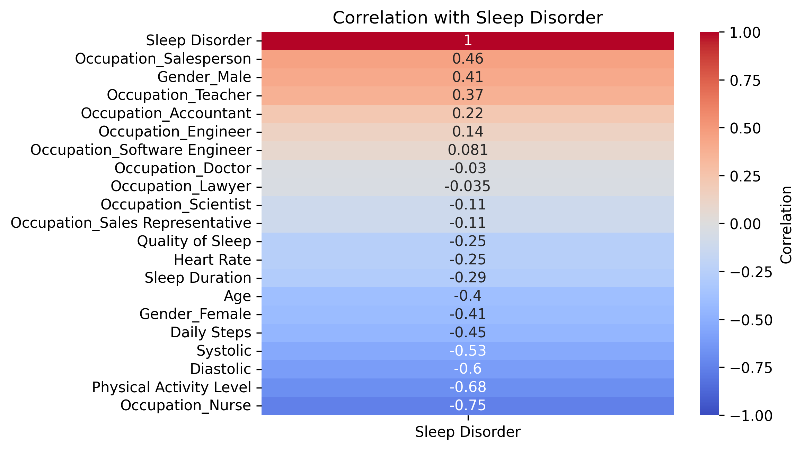
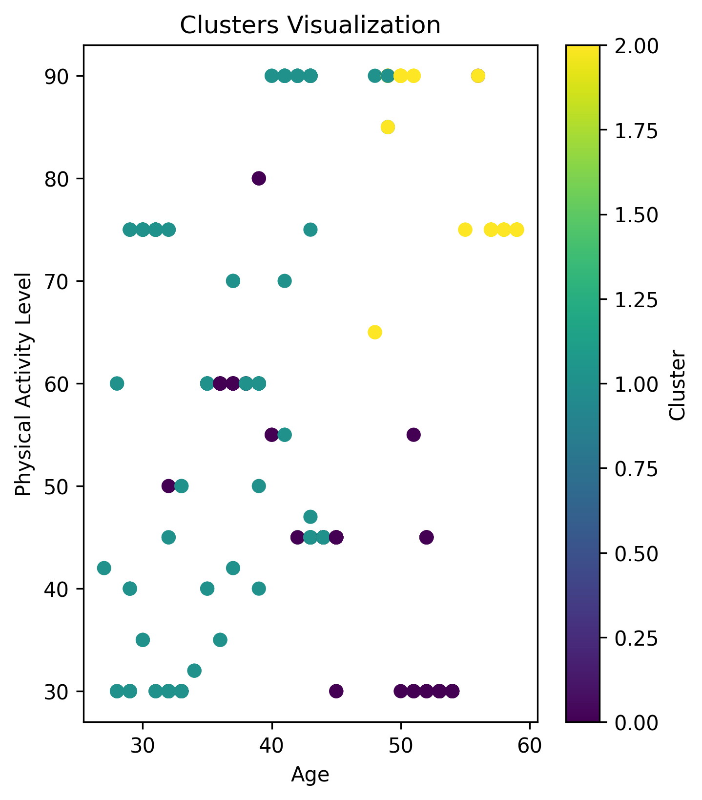

# Sleep Health Analysis Project

## Overview

The **Sleep Health Analysis** project aims to analyze sleep health data and predict sleep disorders (such as Sleep Apnea and Insomnia) using machine learning techniques. The project involves the following stages:

- **Data Preprocessing**: Cleaning, feature engineering, and encoding the dataset.
- **Exploratory Data Analysis (EDA)**: Gaining insights from the data through statistical analysis.
- **Model Training**: Training a RandomForestClassifier to predict sleep disorders.
- **Clustering**: Applying K-means clustering to group individuals based on their characteristics.

## Project Structure

- **Data Files:**
  - `Sleep_health_and_lifestyle_dataset.csv`: The raw dataset for analysis.
  - `res_dpre.csv`: The imputed dataset with predicted sleep disorder labels.
  
- **Scripts:**
  - `dpre.py`: Data preprocessing, including feature engineering, imputation, and model training using Random Forest.
  - `eda.py`: Exploratory Data Analysis, generating insights such as sleep disorder percentages, average sleep duration by gender, and most common occupations among those with sleep disorders.
  - `load.py`: Contains the function to load the dataset.
  - `model.py`: Implements K-means clustering to segment the dataset based on specific features.
  - `final.sh`: Bash script that automates the process of copying results from the Docker container to the local machine.

- **Docker Configuration:**
  - **Dockerfile**: Instructions to build the containerized environment for running the analysis.

## Setup Instructions

### Prerequisites

- **Docker**: Ensure Docker is installed on your machine. If not, follow the installation guide from the official Docker website.
- **Python**: Make sure Python is installed along with required libraries (listed in `requirements.txt`).

### Build the Docker Container

To build the Docker container for this project, run:

### Run the Container

To run the container and mount your working directory to the container, use:

```bash
docker run my26l/assignment_1
```

### Activate the Virtual Environment

Once inside the container, activate the virtual environment:

```bash
/opt/venv/bin/python /home/doc-bd-a1/load.py
```

## Usage

### Data Preprocessing (`dpre.py`)

The `dpre.py` script:
- Loads and cleans the dataset.
- Encodes categorical columns (Gender, Occupation) using one-hot encoding.
- Scales features and splits the data into training and testing sets.
- Trains a RandomForestClassifier and evaluates its performance.

### Exploratory Data Analysis (`eda.py`)

The `eda.py` script generates the following insights:
- **Percentage of individuals with sleep disorders** (Sleep Apnea vs Insomnia).
- **Average sleep duration by gender**.
- **Most common occupation among those with sleep disorders**.

### Clustering (`model.py`)

The `model.py` script applies K-means clustering on the dataset and visualizes the clusters. It segments individuals based on features like `Age` and `Physical Activity Level`.

### Final Steps (`final.sh`)

The `final.sh` script automates the process of copying output files (e.g., Python scripts, visualizations, CSVs) from the Docker container to your local machine.

## Results and Insights

After running the scripts, the following outputs are generated:
- **EDA Insights**:
  - `eda-in-1.txt`: Percentage of individuals with sleep disorders.
  - `eda-in-2.txt`: Average sleep duration by gender.
  - `eda-in-3.txt`: Most common occupation among those with sleep disorders.
- **Visualization** saved as `vis2.png`, showing clusters based on `Age` and `Physical Activity Level`.
- **Clustering Results** saved in `k.txt`, listing the number of records in each cluster.

## Visualizations

### 1. Correlation with Sleep Disorder

This heatmap shows the correlation of various features with the `Sleep Disorder` label.



### 2. Clusters Visualization

This scatter plot visualizes the K-means clustering of the dataset.



## Conclusion

This project demonstrates how to preprocess sleep health data, train predictive models, perform clustering, and analyze the results in a containerized environment. The insights generated from this project help understand the factors contributing to sleep disorders and how they vary by gender and occupation.
