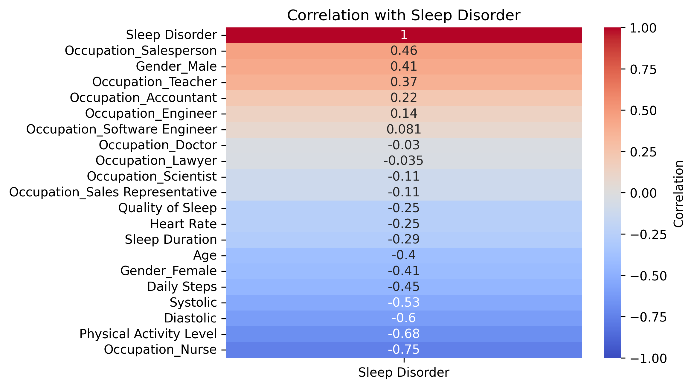
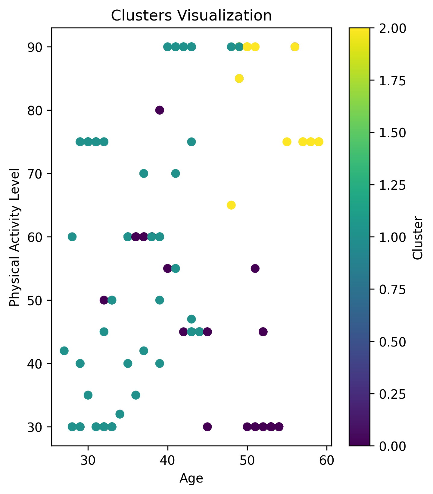

# Sleep Health Analysis Project

This project aims to analyze sleep health data and predict sleep disorders using machine learning techniques. It includes data preprocessing, exploratory data analysis (EDA), model training, and clustering.

## Project Structure

- **Data Files:**
  - `Sleep_health_and_lifestyle_dataset.csv`: The raw dataset for analysis.
  - `res_dpre.csv`: The imputed dataset with predicted sleep disorder labels.
  
- **Scripts:**
  - `dpre.py`: Script for data preprocessing, including feature engineering, imputation, and model training using Random Forest.
  - `eda.py`: Performs exploratory data analysis and generates insights from the dataset.
  - `load.py`: Contains the function to load the dataset.
  -  `vis.py`: Contains the correlations in relation with our target feature.
  - `model.py`: Implements K-means clustering to segment the data.
  - `final.sh`: Bash script to automate the containerized environment and file management.
  
- **Docker Configuration:**
  - **Dockerfile**: Contains instructions to build the containerized environment for running the analysis.

## Setup Instructions


### Run the Container

To run the container and mount the current working directory to the container, use:

```bash
docker run -it my26l/assignment_1:latest
```

### Activate the Virtual Environment

Once inside the container, activate the virtual environment with:

```bash
/opt/venv/bin/python /home/doc-bd-a1/$script$.py
```

## Data Preprocessing (`dpre.py`)

This script handles the following tasks:
- Loads the dataset and performs cleaning (e.g., handling missing values, dropping irrelevant columns).
- Maps the 'Sleep Disorder' column to numeric values.
- One-hot encodes categorical columns like 'Gender' and 'Occupation'.
- Scales the features and splits the data into training and testing sets.
- Trains a RandomForestClassifier to predict sleep disorders and evaluates its performance.


## Exploratory Data Analysis (`eda.py`)

This script generates insights from the dataset:
- **Percentage of individuals with sleep disorders** (Sleep Apnea vs Insomnia).
- **Average sleep duration by gender**.
- **Most common occupation among those with sleep disorders**.

## Model Training and Clustering (`model.py`)

The `model.py` script applies K-means clustering to segment the dataset. It selects relevant features, scales them, and performs clustering. It visualizes the clusters using a scatter plot of `Age` vs `Physical Activity Level`.


## Final Steps (`final.sh`)

This bash script automates the process of copying results from the Docker container to the local machine. It handles the copying of Python scripts, text files , and output files (like visualizations and CSVs).


## Results and Insights

After running the scripts, the following insights and outputs are generated:
- **EDA Insights** stored in text files:
  - `eda-in-1.txt`: Percentage of individuals with sleep disorders.
  - `eda-in-2.txt`: Average sleep duration by gender.
  - `eda-in-3.txt`: Most common occupation among those with sleep disorders.
- **Visualization** saved as `vis2.png`, showing clusters based on `Age` and `Physical Activity Level`.
- **Clustering Results** saved in `k.txt`, listing the number of records in each cluster.

## Visualizations

### 1. Correlation with Sleep Disorder

This heatmap shows the correlation of various features with the `Sleep Disorder` label. Positive correlations indicate a tendency for higher values in the feature to correspond with the presence of a sleep disorder, while negative correlations suggest the opposite.



### 2. Clusters Visualization

This scatter plot visualizes the K-means clustering of the dataset. The clusters are formed based on the features like `Age` and `Physical Activity Level`. The color gradient represents different clusters.



## Conclusion
This project demonstrates the ability to preprocess sleep health data, train predictive models, perform clustering, and analyze the results in a containerized environment. The final outputs provide valuable insights into the factors contributing to sleep disorders and how they vary by gender and occupation.

